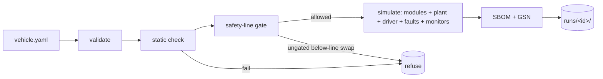

# Loom

**Open vehicle composition & virtual-validation framework.**

[](https://github.com/toto171/loom/actions/workflows/ci.yml)
[](LICENSE)
[](https://www.python.org/)

Declare a vehicle as a composition of swappable subsystems (BMS, powertrain, ADAS, HMI,
body…), each behind a **contract that carries safety semantics**, run the composed vehicle
against a **physics plant model in simulation**, and **generate the assurance case + SBOM as
you compose**. Above the safety line, modules mix-and-match freely; below it, swaps trigger
re-validation gates.

The novel core is the **contract layer**: existing buses (VSS, SOME/IP, DDS) carry the bytes
but not the *safety semantics*. Loom makes those semantics first-class and machine-checkable.

> ⚠️ This is **development and validation tooling**, not a certified in-vehicle production
> runtime. The generated SBOM and assurance case are *starting points*, never certification.
> See [docs/design-brief.md](docs/design-brief.md) §11.

---

## Quickstart

Requires **Python 3.12+**. (Docker is only needed for the live KUKSA broker; everything else,
including the full test suite, runs without it.)

```bash
python -m venv .venv
source .venv/bin/activate          # Windows: .venv\Scripts\activate
pip install -e ".[dev]"            # package + dashboard + compose + pytest + ruff

loom validate spec/vehicle.example.yaml                            # schema validation -> OK
loom check    spec/vehicle.example.yaml                            # static contract check + report
loom check    spec/vehicle.broken.yaml                             # deliberately broken -> precise failure
loom check    spec/vehicle.broken_units.yaml                       # unit mismatch (mph vs km/h) -> unit_consistency error
loom run      spec/vehicle.example.yaml --scenario urban_drive          # 5 modules; speed tracks, SoC drops
loom run      spec/vehicle.example.yaml --scenario sensor_dropout_test  # temp dropout trips a BMS monitor
loom run      spec/vehicle.swap_bms.yaml                                # below-line swap -> refused without --revalidate
loom run      spec/vehicle.swap_hmi.yaml                                # above-line (QM) swap -> free, no gate
loom run      spec/vehicle.motoquant.yaml                               # swap to the higher-fidelity plant (no module change)
loom sbom     spec/vehicle.example.yaml                                 # vehicle + per-module CycloneDX SBOMs (no sim)

uvicorn dashboard.app:app          # web dashboard at http://127.0.0.1:8000
pytest                             # 136 tests (M0–M6)
```

Each `loom run` writes `runs/<id>/` — trace, report, violations, an aggregate CycloneDX
vehicle SBOM plus one per-module SBOM (each contract's `sbomRef`), and a GSN assurance case.
`loom sbom` emits just the SBOMs without a sim. See the [CLI reference](docs/cli.md).

---

## The pipeline

One command, `loom run`, executes the whole loop (shared by the CLI and the dashboard via
`execute_run` in [`loom/run.py`](loom/run.py)):

```
compose → validate → check → gate → simulate → assure
```



**The whole thesis in one demo:** swap in a miscalibrated below-line BMS → the **gate**
refuses it → `--revalidate` proceeds → the **runtime monitor** catches the drift → the
**assurance case auto-defeats** the affected goals. Safety as a first-class, checkable
contract. Walk-through in [docs/safety-model.md §5](docs/safety-model.md#5-the-end-to-end-safety-story-one-demo).

---

## Documentation

| Doc | For |
|---|---|
| [docs/architecture.md](docs/architecture.md) | the pipeline, the swappable abstractions, the repo layout — **start here** |
| [docs/contracts.md](docs/contracts.md) | the two core schemas (`vehicle.yaml` + `contract.yaml`) and the checker |
| [docs/safety-model.md](docs/safety-model.md) | the safety line, the swap gate, the lock, the trust model |
| [docs/extending.md](docs/extending.md) | add a subsystem, plant, scenario, or checker rule |
| [docs/cli.md](docs/cli.md) · [docs/dashboard.md](docs/dashboard.md) | use the CLI / the web UI |
| [docs/glossary.md](docs/glossary.md) | VSS, FMI, GSN, SBOM, ASIL, QM, ODD, SOTIF, KUKSA… |
| [docs/design-brief.md](docs/design-brief.md) | the founding handoff brief — the *why* and the milestone acceptance criteria |

Contributors: [CONTRIBUTING.md](CONTRIBUTING.md) · [SECURITY.md](SECURITY.md) ·
[CHANGELOG.md](CHANGELOG.md) · [CODE_OF_CONDUCT.md](CODE_OF_CONDUCT.md).

---

## Status — M0–M6 complete

The full roadmap is implemented and green (**136 tests**). Highlights, each with automated
acceptance ([design brief §8](docs/design-brief.md)):

- **M0–M1** — composition + contract JSON Schemas, an in-process VSS shim bus, **five
  reference modules** (`bms` ASIL-C, `powertrain` ASIL-B, `adas` ASIL-B stub, `hmi` QM,
  `body` QM) and a longitudinal plant in a closed cross-module control loop: the driver sets
  a target speed → powertrain commands torque → plant integrates speed + power → BMS
  integrates State-of-Charge (with regen). Speed tracks the cycle; SoC drops.
- **M2** — the static composition checker (producer-uniqueness, signal-resolution, units,
  timing, assume/guarantee) plus an **open-source license policy**: every default module is
  Apache-2.0, declared in its contract and *enforced by the checker*.
- **M3** — runtime monitors over a sandboxed safe-eval predicate layer + fault injection
  (`dropout` / `stuck` / `latency` / `crash`); a battery-temp dropout trips the BMS monitor
  at [8–12 s].
- **M4** — the safety-line swap gate: a below-line BMS swap is refused until `--revalidate`;
  the baseline lives in a committed lock so deleting `runs/` can't reset it.
- **M5** — assurance generation: a CycloneDX vehicle SBOM (plus one per-module SBOM, the
  artifact each contract's `sbomRef` points at) + a GSN assurance-case skeleton whose goals
  **defeat** when their evidence fails (the biased BMS swap defeats `G-bms` and the top-level
  safety goal). `loom sbom` emits the SBOMs standalone, without a sim run.
- **M6** — a higher-fidelity **Motoquant** plant (RK4 + thermal) that drops in via
  `plant.impl` with no module change, a **FastAPI + HTMX/Alpine dashboard** (compose · run ·
  view), and a distributed **Compose/KUKSA** orchestrator sharing the same `Bus` interface
  and tick loop as the in-process path (verified equivalent against an injected client; the
  live databroker path uses `docker-compose.yml`).

---

## Notable design decisions

- **Orchestrator ↔ broker pairing.** An in-process broker can't be shared across containers,
  so Loom pairs `InProcessOrchestrator`+`ShimBus` (default, deterministic) and
  `ComposeOrchestrator`+`KuksaBus` (networked) behind one `Orchestrator` interface — both
  reusing the same tick loop. Eclipse Ankaios can later replace Compose behind it.
- **The safety baseline is committed state.** The lock at `locks/<name>.lock.json` is
  versioned, not gitignored, so a routine `rm -rf runs/` can't silently reset the gate. The
  trust model is explicit about its boundaries — see [docs/safety-model.md](docs/safety-model.md).
- **Honest scope, everywhere.** `assume/guarantee` discharge is a producer-presence proxy;
  the SBOMs (vehicle + per-module) are module-level (declared licenses), not a transitive
  scan; the GSN is a generated skeleton. Each is stated in the code and the docs rather than
  overclaimed. Details in [docs/contracts.md](docs/contracts.md) and
  [docs/architecture.md](docs/architecture.md).

Built on open standards — COVESA VSS, Eclipse KUKSA, FMI, CycloneDX, GSN, and the ISO
26262 / 21448 / PAS 8800 vocabulary.

---

## License

[Apache-2.0](LICENSE). All default/reference modules are open-source by policy.
