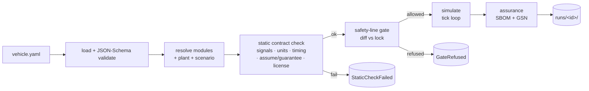

# Architecture

This is the as-built map of Loom: the pipeline, the swappable abstractions, the
simulation loop, and where everything lives. Read this first — most other docs
([contracts](contracts.md), [safety model](safety-model.md),
[extending](extending.md)) drill into one box on this page.

> Provenance: the original intent is in the [design brief](design-brief.md) §2 (concepts)
> and §4 (architecture). Where the brief and this page disagree, **this page is the
> as-built truth.**

---

## 1. The one-paragraph version

You declare a vehicle as a `vehicle.yaml` — a set of **subsystems**, each picking an
**implementation** (`default` or a swap), plus a **plant** (physics) and a **scenario**
(stimulus). Loom validates the spec, resolves the modules, **statically checks** that
their **contracts** are compatible (signals, units, timing, assumptions, license),
applies the **safety-line gate** (below-line swaps need re-validation), then **simulates**
the composed vehicle over a virtual **VSS bus** against the plant — injecting faults and
evaluating **runtime monitors** — and finally emits an **SBOM** and a **GSN assurance
case** for that exact composition. One command, `loom run`, does all of it.

---

## 2. The pipeline



Every stage lives behind one function, **`execute_run`** in [`loom/run.py`](../loom/run.py),
which is shared verbatim by the CLI ([`loom/cli.py`](../loom/cli.py)) and the web dashboard
([`dashboard/app.py`](../dashboard/app.py)) — so the browser and the terminal cannot
diverge in behavior (they inherit the same gate, the same checks, the same artifacts).
`execute_run` raises `StaticCheckFailed` or `GateRefused` (see
[`loom/errors.py`](../loom/errors.py)); callers translate those into an exit code or an
HTTP status.

| Stage | Module | What it does |
|---|---|---|
| Compose | [`loom/compose/`](../loom/compose) | load `vehicle.yaml`, JSON-Schema-validate, resolve the selected module set |
| Check | [`loom/contracts/`](../loom/contracts) | static composition checker + human-readable report |
| Gate | [`loom/safety/gate.py`](../loom/safety/gate.py) | diff the composition against the committed lock; refuse ungated below-line swaps |
| Simulate | [`loom/orchestrator/`](../loom/orchestrator), [`loom/sim/`](../loom/sim) | drive the scenario over the bus + plant, inject faults, run monitors, record a trace |
| Assure | [`loom/assurance/`](../loom/assurance) | CycloneDX SBOM + GSN assurance-case skeleton |

---

## 3. The swappable abstractions

Loom's thesis is swappability, so the framework's own internals are interface-first —
each has **≥2 implementations** so the seams are real, not theoretical. When you add a
feature, you are almost always adding an implementation behind one of these.

| Interface | File | Implementations | Swap point |
|---|---|---|---|
| **`Bus`** | [`loom/bus/base.py`](../loom/bus/base.py) | `ShimBus` (in-process), `KuksaBus` (gRPC databroker) | the signal backbone |
| **`Plant`** | [`loom/plant/base.py`](../loom/plant/base.py) | `longitudinal` (forward-Euler), `motoquant` (RK4 + thermal) | vehicle physics (FMI-style boundary) |
| **`Orchestrator`** | [`loom/orchestrator/base.py`](../loom/orchestrator/base.py) | `InProcessOrchestrator`, `ComposeOrchestrator` (KUKSA) | how modules are brought up |
| **`Module`** | [`loom/module.py`](../loom/module.py) | the 5 reference subsystems in [`modules/`](../modules) | subsystem behavior |
| **`Contract`** | [`loom/contracts/model.py`](../loom/contracts/model.py) | one `contract.yaml` per module impl | the safety-carrying interface |

The **contract** is the part that does not exist in open tooling today: existing buses
(VSS, SOME/IP, DDS) carry the *bytes* but not the *safety semantics*. Loom makes those
semantics first-class and machine-checkable. See [contracts.md](contracts.md).

### Bus — the VSS signal vocabulary

Modules never call each other; they publish/read **VSS dotted paths**
(`Vehicle.Speed`, `Vehicle.Powertrain.TractionBattery.StateOfCharge.Current`, …) on a
`Bus`. The `Bus` interface is tiny — `publish(path, value, unit, producer)`, `read(path,
default)`, `snapshot()`, `unit_of`, `producer_of`. `ShimBus` is an in-process dict-backed
broker (default, deterministic, no runtime needed); `KuksaBus` is the same interface over
a real Eclipse KUKSA databroker via gRPC. Both share **None-vs-unset** semantics so a
dropped sensor behaves identically in-process and distributed (see
[`tests/test_m6_compose_kuksa.py`](../tests/test_m6_compose_kuksa.py)).

### Plant — the physics, behind an FMI-style boundary

The `Plant` integrates vehicle dynamics and publishes ground-truth signals (speed,
electrical power, battery temperature) the modules sense. Swapping `plant.impl` from
`longitudinal` to `motoquant` raises fidelity (RK4 integration + a thermal battery model)
with **no module change** — that's the FMI plug-in point that lets a high-fidelity engine
drop in later. The plant also exposes a sim-only **ground-truth channel** that runtime
monitors read via `truth:` bindings.

---

## 4. The simulation tick loop

One loop, [`drive()`](../loom/orchestrator/_loop.py) in `loom/orchestrator/_loop.py`, is
shared by **both** orchestrators, so a distributed run behaves identically to an in-process
one. Each fixed-step tick runs, in order:

```
stimulus → plant.step → faults.apply → modules.step → monitors.evaluate → record
```

1. **stimulus** ([`sim/stimulus.py`](../loom/sim/stimulus.py)) — the scenario driver
   publishes set-points (target speed, cruise active, charging flag).
2. **plant.step** — integrate physics; publish ground-truth speed / power / temperature.
3. **faults.apply** ([`sim/faults.py`](../loom/sim/faults.py)) — corrupt signals per the
   scenario (`dropout` / `stuck` / `latency` / `crash`) *before* modules and monitors see
   them.
4. **modules.step** — each module reads its `requires` signals and writes its `provides`.
5. **monitors.evaluate** ([`monitors/engine.py`](../loom/monitors/engine.py)) — every
   `failureMode.detect` predicate (and evaluable `guarantee`) is checked against the bus +
   plant ground truth; violations are timestamped.
6. **record** ([`sim/trace.py`](../loom/sim/trace.py)) — snapshot every signal for this
   tick into the trace.

A known, documented simplification: a single fixed-order pass gives a one-tick
producer→consumer lag (there is no dependency scheduler). See [m1-design.md](m1-design.md).

---

## 5. Repository layout (as-built)

```
DriveOS/                         # repo root
├── README.md                    # front door
├── CONTRIBUTING.md              # dev setup, conventions, how to add things
├── CHANGELOG.md  SECURITY.md  CODE_OF_CONDUCT.md  LICENSE
├── pyproject.toml               # package, extras (dashboard/compose/dev), ruff config
├── docker-compose.yml           # KUKSA databroker bring-up (distributed orchestrator)
│
├── loom/                        # the framework package
│   ├── cli.py                   # `loom` entrypoint (Typer)
│   ├── run.py                   # execute_run(): the shared compose→…→assure pipeline
│   ├── errors.py paths.py schema.py catalog.py module.py
│   ├── compose/                 # parse + JSON-Schema-validate spec, resolve module set
│   ├── contracts/               # contract model, loader, static checker, report
│   ├── bus/                     # Bus abstraction: shim (default) + kuksa (gRPC)
│   ├── plant/                   # Plant abstraction + loader
│   ├── orchestrator/            # InProcess + Compose, sharing _loop.drive()
│   ├── sim/                     # stimulus, faults, scenario, trace
│   ├── monitors/                # safe-eval predicate layer + monitor engine
│   ├── safety/                  # the safety-line swap gate
│   └── assurance/               # CycloneDX SBOM + GSN assurance-case builder
│
├── modules/                     # reference subsystem implementations (Apache-2.0)
│   ├── bms/ powertrain/ adas/ hmi/ body/   # each: service.py + contract.yaml
│
├── plant/                       # plant implementations (content, not package code)
│   ├── longitudinal/plant.py    # v0 default (forward-Euler)
│   └── motoquant/plant.py       # M6 higher-fidelity (RK4 + thermal)
│
├── spec/                        # composition specs + the two JSON Schemas
│   ├── schema/{composition,contract}.schema.json
│   └── vehicle.*.yaml           # example, m0, broken, motoquant, swap_bms, swap_hmi
│
├── scenarios/                   # drive cycles + fault scripts
│   ├── urban_drive.yaml  sensor_dropout_test.yaml
│
├── dashboard/                   # M6 FastAPI + HTMX/Alpine web UI
│   ├── app.py  templates/
│
├── locks/                       # committed safety baselines (one per vehicle name)
├── docs/                        # you are here
├── tests/                       # pytest suite (M0–M6 acceptance + unit fixtures)
└── runs/                        # generated per-run artifacts (gitignored)
```

Two deliberate separations worth noting for newcomers:

- **`loom/` (the framework) vs `modules/` + `plant/` (reference content).** The package is
  the engine; `modules/` and `plant/` are example implementations it loads by name. You can
  add a subsystem or a plant without touching `loom/`. See [extending.md](extending.md).
- **`locks/` (committed) vs `runs/` (gitignored).** The safety baseline a vehicle is gated
  against is *versioned state that travels with the repo*, so deleting generated runs can't
  silently reset it. See [safety-model.md](safety-model.md).

---

## 6. Artifacts of a run

`loom run <spec>` writes one directory, `runs/<id>/`:

| File | Contents |
|---|---|
| `trace.jsonl` | per-tick snapshot of every signal |
| `run.json` | summary: modules, scenario, steps, changed signals, violations, assurance |
| `composition_report.txt` | the static-check report (signal graph + per-rule results) |
| `violations.jsonl` | timestamped runtime monitor violations |
| `vehicle.cdx.json` | CycloneDX SBOM (bill of modules + declared licenses) |
| `assurance.gsn.yaml` / `.mmd` | GSN assurance case (machine-readable + Mermaid) |
| `revalidation.json` | record of re-validated below-line swaps — present **only** when `--revalidate` was used |

A run is a pure function of its inputs (the spec, the scenario, the module/plant versions,
the VSS release) — see [design brief](design-brief.md) §10.5 (reproducibility). The SBOM
serial number is a deterministic UUIDv5 and timestamps are omitted so identical inputs
produce byte-identical assurance.

---

## 7. Where to go next

- **Write or change a contract / spec** → [contracts.md](contracts.md)
- **Add a subsystem, plant, scenario, or checker rule** → [extending.md](extending.md)
- **Understand the gate / QM vs ASIL / locks** → [safety-model.md](safety-model.md)
- **Use the CLI** → [cli.md](cli.md) · **Run the web UI** → [dashboard.md](dashboard.md)
- **Decode the jargon** (VSS, FMI, GSN, ASIL, ODD, SOTIF…) → [glossary.md](glossary.md)
