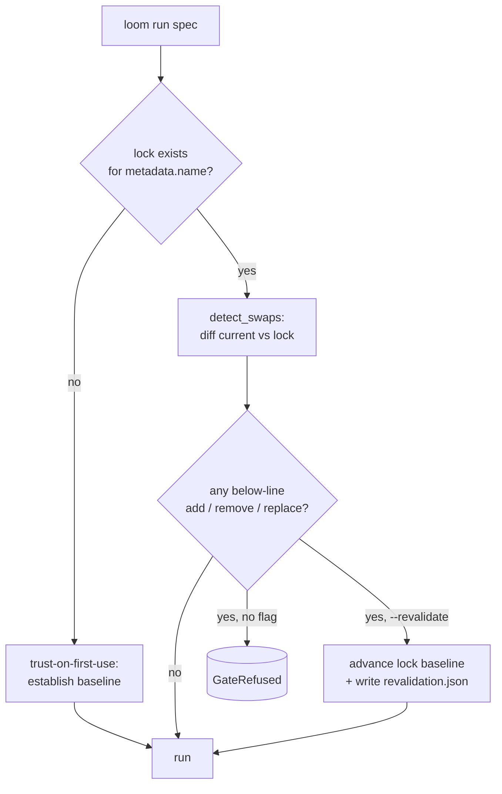

# Safety model — the line, the gate, the lock

The defining idea of Loom is that **safety is a first-class, machine-checkable property of
a composition**, not a document you write afterwards. This page explains the safety line,
the swap gate that enforces it, and the lock that anchors it.

> Provenance: [design brief](design-brief.md) §2, §5.2 (final rule), §8 M4, §10.4.
> Implementation: [`loom/safety/gate.py`](../loom/safety/gate.py).

---

## 1. The safety line

Every module declares a `safetyLevel` in its [contract](contracts.md):

```
QM        ← above the line: freely swappable (infotainment, HMI, body, …)
──────────  the safety line ──────────
ASIL-A
ASIL-B
ASIL-C    ← below the line: swaps are gated + recorded (BMS, powertrain, ADAS, brakes)
ASIL-D
```

- **Above the line (`QM`)** — "Quality Managed." No safety integrity claim. Swap freely;
  no gate. The reference `hmi` and `body` modules are QM.
- **Below the line (`ASIL-*`)** — Automotive Safety Integrity Level A→D (ISO 26262, rising
  rigor). Replacing one of these, or adding/removing one, requires explicit
  **re-validation**. The reference `bms` (ASIL-C), `powertrain` (ASIL-B), and `adas`
  (ASIL-B) are below the line.

The principle (design brief §10.4): *never let a below-line module swap pass silently.*

---

## 2. The swap gate

On every run, [`gate()`](../loom/safety/gate.py) compares the **current composition**
against the vehicle's **last-validated configuration** (the lock) and classifies the diff:



`detect_swaps` takes the **union** of subsystems across the lock and the current spec, so
all three of these are gated changes when they touch a below-line subsystem:

- **replace** an implementation (`bms.default` → `bms.custom_x`),
- **add** a below-line subsystem,
- **remove** a below-line subsystem.

A QM-only change (e.g. `hmi.default` → `hmi.custom`) is **not** gated — it runs freely.

**Fail-safe by construction:** if a lock entry is malformed or missing its `safetyLevel`,
the gate treats it as below-line and **gates** (refuses rather than assuming QM). The safe
default is to stop.

When a below-line swap is detected without `--revalidate`, `execute_run` raises
`GateRefused`; the CLI prints the reason and exits `3`, and the dashboard returns HTTP
`409`. Re-running with `--revalidate` advances the lock baseline to the new configuration
and records the acknowledgement in `runs/<id>/revalidation.json`.

---

## 3. The lock — committed safety baseline

The baseline lives at **`locks/<metadata.name>.lock.json`** and is **committed, versioned
state** — *not* gitignored runtime. This is deliberate: a routine `rm -rf runs/` (the
generated, gitignored run artifacts) must not be able to silently reset the safety
baseline. The baseline travels with the repo and shows up in code review. Writes are
**atomic** (temp file + `os.replace`).

```jsonc
// locks/toy-ev-l7.lock.json — the last-validated baseline (the whole file)
{
  "vehicle": "toy-ev-l7",
  "subsystems": {
    "bms": { "impl": "default", "safetyLevel": "ASIL-C" },
    "hmi": { "impl": "default", "safetyLevel": "QM" }
    // … one entry per subsystem
  }
}
```

The lock holds **only** the validated configuration (`vehicle` + per-subsystem `impl` and
`safetyLevel`). A re-validation does two things: it **advances this baseline** to the new
configuration, and it writes a separate, timestamped **`runs/<id>/revalidation.json`**
recording the acknowledged swap (`subsystem`, `from`/`to` impl, old/new safety level).

---

## 4. Trust model (and its honest boundaries)

This is dev/validation tooling, not a certified runtime — so the trust model is explicit
about what it does and does not guarantee:

- **Trust anchor is `metadata.name`.** Two specs sharing a name are compared against the
  same baseline — that is *how the swap demo works* (`vehicle.example.yaml` and
  `vehicle.swap_bms.yaml` share `toy-ev-l7`). Renaming the vehicle starts a fresh baseline.
  The name is schema-restricted to block path injection into the lock path.
- **Trust-on-first-use (TOFU).** The first run of a vehicle name establishes its baseline.
  If that first composition contains below-line modules, the run prints a baseline notice.
  Establish baselines from a known-good spec.
- **Gates on the union of subsystems**, fail-safe on a malformed lock (see §2).

What the gate does *not* do: it does not prove the swapped module is *correct* — it ensures
the swap is *acknowledged and recorded*, and (combined with the runtime monitors) that a
miscalibration introduced by the swap is *caught*. See the end-to-end story below.

---

## 5. The end-to-end safety story (one demo)

This is the whole thesis in one sequence — gate **and** monitor **and** assurance moving
together when you swap a below-line module:

```bash
loom run spec/vehicle.example.yaml --scenario urban_drive   # 1. establish baseline (bms.default)
loom run spec/vehicle.swap_bms.yaml                         # 2. ASIL-C BMS swap -> REFUSED (exit 3)
loom run spec/vehicle.swap_bms.yaml --revalidate            # 3. acknowledged -> runs + records
#   -> the biased bms.custom_x trips the soc_estimate_drift monitor at run time
#   -> which DEFEATS the G-bms goal and the top-level safety goal in the GSN assurance case
```

1. The **gate** refuses the silent below-line swap.
2. `--revalidate` lets it proceed, advances the lock baseline, and records the
   acknowledgement in `runs/<id>/revalidation.json`.
3. The **runtime monitor** catches the SoC drift the miscalibrated BMS introduces.
4. The **assurance case** auto-defeats the affected goals — the safety argument visibly
   changes with the composition.

Contrast with an above-line swap, which needs none of this:

```bash
loom run spec/vehicle.swap_hmi.yaml    # QM HMI swap -> free, no gate, no re-validation
```

See [`tests/test_m4_gate.py`](../tests/test_m4_gate.py) and the dashboard's inherited gate
in [`tests/test_m6_dashboard.py`](../tests/test_m6_dashboard.py).
